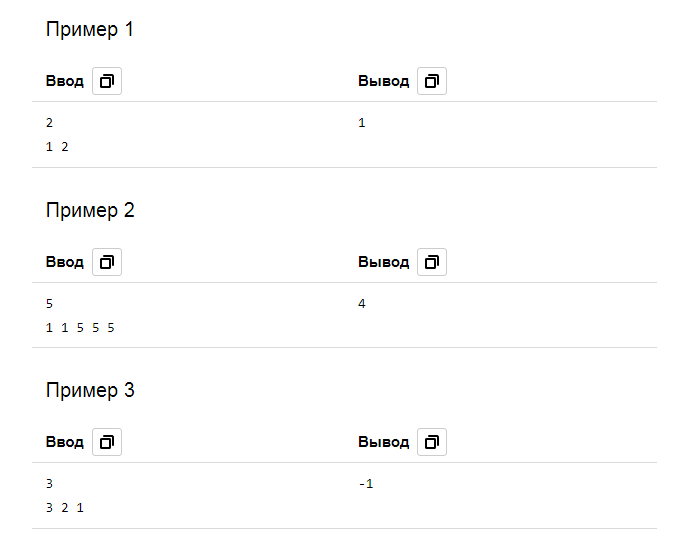

# A. Андрей и кислота

| Параметр            | Условие                          |
|---------------------|----------------------------------|
| Ограничение времени | 2 секунды                        |
| Ограничение памяти  | 512Mb                            |
| Ввод                | стандартный ввод или input.txt   |
| Вывод               | стандартный вывод или output.txt |

Андрей работает в секретной химической лаборатории, в которой производят опасную кислоту с удивительными свойствами. У
Андрея есть
n
бесконечно больших резервуаров, расположенных в один ряд. Изначально в каждом резервуаре находится некоторое количество
кислоты. Начальство Андрея требует, чтобы во всех резервуарах содержался одинаковый объем кислоты. К сожалению,
разливающий аппарат несовершенен. За одну операцию он способен разлить по одному литру кислоты в каждый из первых
**_k_** (1 ≤ k ≤ n)
резервуаров. Обратите внимание, что для разных операций
**_k_**
могут быть разными. Поскольку кислота очень дорогая, Андрею не разрешается выливать кислоту из резервуаров. Андрей
просит вас узнать, можно ли уравнять объемы кислоты в резервуарах, и, если это возможно, то посчитать минимальное
количество операций, которое потребуется, чтобы этого достичь.

### Формат ввода
Первая строка содержит число
**_n_**
(1 ≤ n ≤ 100_000) — количество резервуаров.  
Во второй строке содержатся
**_n_**
целых чисел
**_ai_**
(1 ≤ ai ≤ 109), где ai
означает исходный объём кислоты в
i-м резервуаре в литрах.

### Формат вывода
Если объемы кислоты в резервуарах можно уравнять, выведите минимальное количество операций, необходимых для этого.
Если это невозможно, выведите «-1».

### Примеры

### Примечания

В первом примере достаточно одной операции с
_**k**_
, равным 1. Тогда в обоих резервуарах окажется по 2 литра.
Во втором примере достаточно четырех операций с
_**k**_
, равным 2. Тогда во всех резервуарах окажется по 5 литров.  
В третьем примере объемы уравнять невозможно.

 

[Назад к списку задач](https://github.com/AlexAkama/yandex_algorithm/tree/main/src/main/java/training/v3b#%D0%B7%D0%B0%D0%B4%D0%B0%D1%87%D0%B8-30)