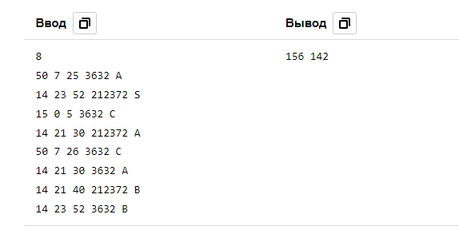

# B. Через тернии к клиенту

| Параметр            | Условие                          |
|---------------------|----------------------------------|
| Ограничение времени | 5 секунды                        |
| Ограничение памяти  | 512Mb                            |
| Ввод                | стандартный ввод или input.txt   |
| Вывод               | стандартный вывод или output.txt |

Известная компания Тындекс идёт в ногу со временем — с началом активных космических перелётов в компании открылся сервис Тындекс.Ракетакси: пользователю необходимо лишь указать координаты начала и конца перелёта, после чего за ним вылетит персональная ракета.
По сути любой заказ можно описать в виде событий четырёх типов:

**A** (accepted) - заказ принят в работу (ракета вылетела за клиентом);  
**B** (boarding) - клиент сел в ракету;  
**S** (success) - заказ успешно завершён (клиент вышел на планете назначения);  
**C** (cancelled) - заказ отменён.  
Все происходящие с ракетами события отправляются на сервера, где сразу логируются. Вот только из-за проблем со связью (метеоритные потоки, вспышки на звездах и т.д.) отправка событий иногда затягивается, из-за чего записи в получившемся логе могут идти не по порядку.

Гарантируется, что все описанные в логе события задают один из следующих сценариев:
* A - B - S  
* A - B - C  
* A - C  

Вам, как главному аналитику (и по совместительству главному программисту) ракетопарка, необходимо исследовать лог за прошедший год и определить для каждой ракеты суммарное время движения (в минутах) в течение заказов.

В каждый момент времени ракета выполняет только один заказ. Будем считать, что каждая ракета в каждый момент времени:
* или стоит на месте в ожидании заказа,
* или перемещается по космосу, выполняя заказ. 

Движение начинается после принятия заказа и завершается после отмены или завершения заказа. За одну минуту не может произойти несколько событий, связанных с одной и той же ракетой.

### Формат ввода
В первой строке дано целое число
**_N_**
(2 ≤ N ≤ 200_000) — количество записей в логе.  
Следующие
**_N_** строк содержат записи в логе в формате
`day hour minute id status`:

* `day` (1 ≤ d ≤ 365) — номер дня (сквозная нумерация с начала календарного года);
* `hour` (0 ≤ h < 24) — часы;
* `minute` ( 0 ≤ m < 60) — минуты;
* `id` (0 ≤ id ≤ 109)— уникальный идентификатор ракеты;
* `status` ∈ {A,B,S,C} — буква, обозначающая тип события.

### Формат вывода
В единственной строке выведите через пробел суммарное время движения на заказах для каждой упомянутой в логе ракеты.  
Данные необходимо выводить в порядке возрастания идентификаторов ракет.

### Пример

### Примечания
##### Ракета №3632
* в 14-й день года в 21:30 получила заказ (шестая запись в логе);
* забрала пассажира в 23:52 того же дня (восьмая запись в логе);
* после чего заказ был отменён в 15-й день года в 00:05 (третья запись в логе);
* в 50-й день года в 7:25 получила заказ (первая запись в логе);
* заказ был отменён уже через минуту (четвёртая запись в логе).  

Таким образом ракета №3632 провела в движении с 14-го дня 21:30 до 15-го дня 00:05 и с 50-го дня 7:25 до 50-го дня 7:26 
— всего **156** минут.

##### Ракета №212372

* в 14-й день года в 21:30 получила заказ (третья запись в логе);
* через 10 минут забрала пассажира (седьмая запись в логе);
* в 23:52 прибыла на место назначения (вторая запись в логе).

Всего ракета №212372 провела в движении с 14-го дня 21:30 до 14-го дня 23:52 
— **142** минуты.

 

[Назад к списку задач](https://github.com/AlexAkama/yandex_algorithm/tree/main/src/main/java/training/v3b#%D0%B7%D0%B0%D0%B4%D0%B0%D1%87%D0%B8-30)