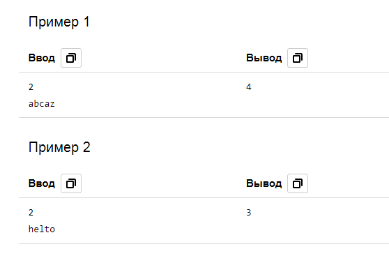

# 2. Красивая строка
| Параметр            | Условие                          |
|---------------------|----------------------------------|
| Ограничение времени | 1 секунда                        |
| Ограничение памяти  | 64Mb                             |
| Ввод                | стандартный ввод или input.txt   |
| Вывод               | стандартный вывод или output.txt |

Красотой строки назовем максимальное число идущих подряд одинаковых букв. (красота строки `abcaabdddettq` равна 3)

Сделайте данную вам строку как можно более красивой, если вы можете сделать не более k операций замены символа.

### Формат ввода
В первой строке записано одно целое число k (0 ≤ k ≤ 109)

Во второй строке дана непустая строчка S (|S| ≤ 2 ⋅ 105). Строчка S состоит только из маленьких латинских букв.

### Формат вывода
Выведите одно число — максимально возможную красоту строчки, которую можно получить.

### Примеры

 

[Назад к списку задач](https://github.com/AlexAkama/yandex_algorithm/tree/main/src/main/java/training/v3b#%D0%B7%D0%B0%D0%B4%D0%B0%D1%87%D0%B8-30)