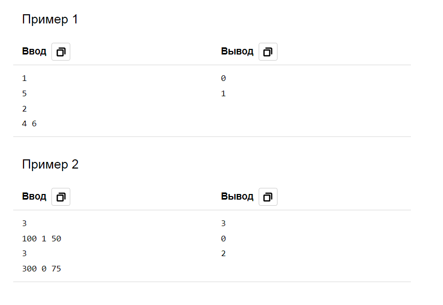

#  Коллекционер Диего

| Параметр            | Условие                          |
|---------------------|----------------------------------|
| Ограничение времени | 1 секунда                        |
| Ограничение памяти  | 256Mb                            |
| Ввод                | стандартный ввод или input.txt   |
| Вывод               | стандартный вывод или output.txt |

Диего увлекается коллекционированием наклеек. 
На каждой из них написано число, и каждый коллекционер мечтает собрать наклейки со всеми встречающимися числами.

Диего собрал **N** наклеек, некоторые из которых, возможно, совпадают. 
Как-то раз к нему пришли **K** коллекционеров. 
i-й из них собрал все наклейки с номерами не меньшими, чем pi. 

Напишите программу, которая поможет каждому из коллекционеров определить, сколько недостающих ему наклеек есть у Диего. Разумеется, гостей Диего не интересуют повторные экземпляры наклеек.

### Формат ввода
В первой строке содержится единственное число N (0 ≤ N ≤ 100 000) — количество наклеек у Диего.

В следующей строке содержатся N целых неотрицательных чисел (не обязательно различных) — 
номера наклеек Диего. Все номера наклеек не превосходят 109.

В следующей строке содержится число K (0 ≤ K ≤ 100 000) — количество коллекционеров, пришедших к Диего. 

В следующей строке содержатся K целых чисел pi (0 ≤ pi ≤ 109), 
где pi — наименьший номер наклейки, не интересующий i-го коллекционера.

Формат вывода
Для каждого коллекционера в отдельной строке выведите количество различных чисел на наклейках, 
которые есть у Диего, но нет у этого коллекционера.

### Примеры

 

[Назад к списку задач](https://github.com/AlexAkama/yandex_algorithm/tree/main/src/main/java/training/v3b#%D0%B7%D0%B0%D0%B4%D0%B0%D1%87%D0%B8-30)