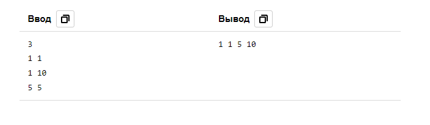

# 8. Минимальный прямоугольник

| Параметр            | Условие                          |
|---------------------|----------------------------------|
| Ограничение времени | 1 секунда                        |
| Ограничение памяти  | 64Mb                             |
| Ввод                | стандартный ввод или input.txt   |
| Вывод               | стандартный вывод или output.txt |

На клетчатой плоскости закрашено **_K_** клеток.  
Требуется найти минимальный по площади прямоугольник, со сторонами, параллельными линиям сетки, покрывающий все закрашенные клетки.

### Формат ввода
Во входном файле, на первой строке, находится число **_K_** (1 ≤ K ≤ 100). 
На следующих K строках находятся пары чисел Xi и Yi 
– координаты закрашенных клеток (|Xi|, |Yi| ≤ 109).

### Формат вывода
Выведите в выходной файл координаты левого нижнего и правого верхнего углов прямоугольника.

### Примеры

 

[Назад к списку задач](https://github.com/AlexAkama/yandex_algorithm/tree/main/src/main/java/training/v3b#%D0%B7%D0%B0%D0%B4%D0%B0%D1%87%D0%B8-30)