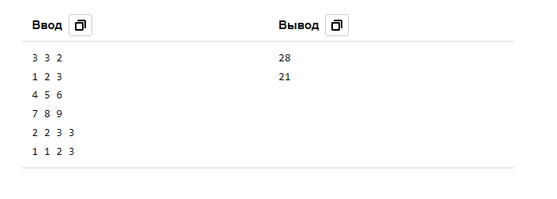

# 9. Сумма в прямоугольнике

| Параметр            | Условие                          |
|---------------------|----------------------------------|
| Ограничение времени | 3 секунды                        |
| Ограничение памяти  | 256Mb                            |
| Ввод                | стандартный ввод или input.txt   |
| Вывод               | стандартный вывод или output.txt |

Вам необходимо ответить на запросы узнать сумму всех элементов числовой матрицы **N×M** 
в прямоугольнике с левым верхним углом (x1, y1) и правым нижним (x2, y2)

### Формат ввода
В первой строке находится числа **N**, **M** размеры матрицы (1 ≤ N, M ≤ 1_000) 
и **K** — количество запросов (1 ≤ K ≤ 100_000).  
Каждая из следующих N строк содержит по M чисел 
— элементы соответствующей строки матрицы (по модулю не превосходят 1000).  
Последующие K строк содержат по 4 целых числа, 
разделенных пробелом x1 y1 x2 y2 
— запрос на сумму элементов матрице в прямоугольнике 
(1 ≤ x1 ≤ x2 ≤ N, 1 ≤ y1 ≤ y2 ≤ M)

### Формат вывода
Для каждого запроса на отдельной строке выведите его результат 
— сумму всех чисел в элементов матрице в прямоугольнике 
(x1, y1), (x2, y2)

### Пример

 

[Назад к списку задач](https://github.com/AlexAkama/yandex_algorithm/tree/main/src/main/java/training/v3b#%D0%B7%D0%B0%D0%B4%D0%B0%D1%87%D0%B8-30)