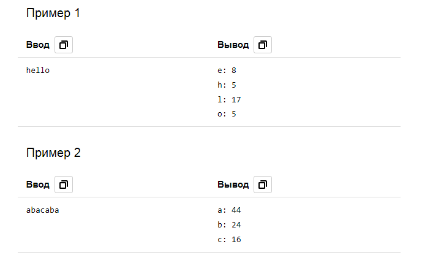

# 10. Скучная лекция

| Параметр            | Условие                          |
|---------------------|----------------------------------|
| Ограничение времени | 1 секунда                        |
| Ограничение памяти  | 64Mb                             |
| Ввод                | стандартный ввод или input.txt   |
| Вывод               | стандартный вывод или output.txt |

Лёша сидел на лекции. Ему было невероятно скучно. Голос лектора казался таким далеким и незаметным...

Чтобы окончательно не уснуть, он взял листок и написал на нём свое любимое слово. Чуть ниже он повторил своё любимое слово, без первой буквы. Ещё ниже он снова написал своё любимое слово, но в этот раз без двух первых и последней буквы.

Тут ему пришла в голову мысль — времени до конца лекции все равно ещё очень много, почему бы не продолжить выписывать всеми возможными способами это слово без какой-то части с начала и какой-то части с конца?

После лекции Лёша рассказал Максу, как замечательно он скоротал время. Максу стало интересно посчитать, сколько букв каждого вида встречается у Лёши в листочке. Но к сожалению, сам листочек куда-то запропастился.

Макс хорошо знает любимое слово Лёши, а ещё у него не так много свободного времени, как у его друга, так что помогите ему быстро восстановить, сколько раз Лёше пришлось выписать каждую букву.

### Формат ввода
На вход подаётся строка, состоящая из строчных латинских букв — любимое слово Лёши.

Длина строки лежит в пределах от 5 до 100_000 символов.

### Формат вывода
Для каждой буквы на листочке Лёши, выведите её, а затем через двоеточие и пробел сколько раз она встретилась в выписанных Лёшей словах (см. формат вывода в примерах). Буквы должны следовать в алфавитном порядке. Буквы, не встречающиеся на листочке, выводить не нужно.

### Примеры

### Примечания
Пояснение к первому примеру. Если любимое Лёшино слово — "hello", то на листочке у Лёши будут выписаны следующие слова:

"hello"  
"hell"  
"ello"  
"hel"  
"ell"  
"llo"  
"he"  
"el"  
"ll"  
"lo"  
"h"  
"e"  
"l"  
"l"  
"o"  

Среди этих слов 8 раз встречается буква "e", 5 раз — буква "h", 17 раз — буква "l" и 5 раз буква "o".

 

[Назад к списку задач](https://github.com/AlexAkama/yandex_algorithm/tree/main/src/main/java/training/v3b#%D0%B7%D0%B0%D0%B4%D0%B0%D1%87%D0%B8-30)