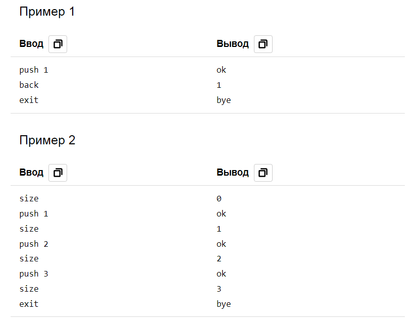
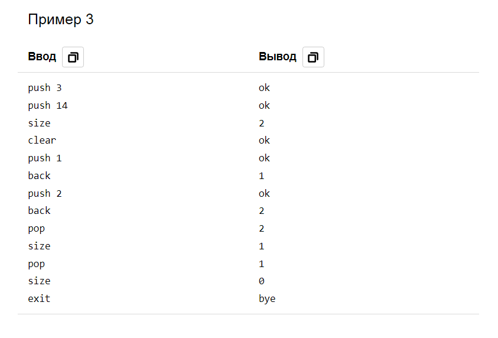

# 11. Стек с защитой от ошибок

| Параметр            | Условие                          |
|---------------------|----------------------------------|
| Ограничение времени | 1 секунда                        |
| Ограничение памяти  | 64Mb                             |
| Ввод                | стандартный ввод или input.txt   |
| Вывод               | стандартный вывод или output.txt |

Научитесь пользоваться стандартной структурой данных stack для целых чисел. 
Напишите программу, содержащую описание стека и моделирующую работу стека, 
реализовав все указанные здесь методы. Программа считывает последовательность команд 
и в зависимости от команды выполняет ту или иную операцию. 
После выполнения каждой команды программа должна вывести одну строчку.  

Возможные команды для программы:

- **push n**  
Добавить в стек число n (значение n задается после команды).  
Программа должна вывести `ok`.

- **pop**  
Удалить из стека последний элемент.  
Программа должна вывести его значение.

- **back**  
Программа должна вывести значение последнего элемента, не удаляя его из стека.

- **size**  
Программа должна вывести количество элементов в стеке.

- **clear**  
Программа должна очистить стек и вывести `ok`.

- **exit**  
Программа должна вывести `bye` и завершить работу.

Перед исполнением операций back и pop программа должна проверять, содержится ли в стеке хотя бы 
один элемент. Если во входных данных встречается операция back или pop, и при этом стек пуст, 
то программа должна вместо числового значения вывести строку `error`.

### Формат ввода
Вводятся команды управления стеком, по одной на строке

### Формат вывода
Программа должна вывести протокол работы стека, по одному сообщению на строке

## Примеры

 

[Назад к списку задач](https://github.com/AlexAkama/yandex_algorithm/tree/main/src/main/java/training/v3b#%D0%B7%D0%B0%D0%B4%D0%B0%D1%87%D0%B8-30)