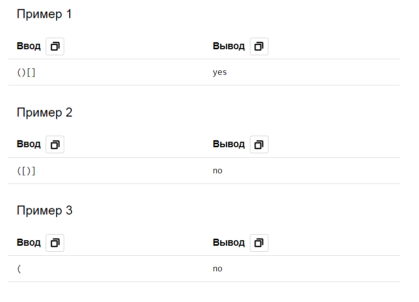

# 12. Правильная скобочная последовательность

| Параметр            | Условие                          |
|---------------------|----------------------------------|
| Ограничение времени | 1 секунда                        |
| Ограничение памяти  | 64Mb                             |
| Ввод                | стандартный ввод или input.txt   |
| Вывод               | стандартный вывод или output.txt |

Рассмотрим последовательность, состоящую из круглых, квадратных и фигурных скобок.  
Программа должна определить, является ли данная скобочная последовательность правильной.  
Пустая последовательность является правильной.  
Если A – правильная, то последовательности (A), [A], {A} – правильные.  
Если A и B – правильные последовательности, то последовательность AB – правильная. 

### Формат ввода
В единственной строке записана скобочная последовательность, содержащая не более 100000 скобок.

### Формат вывода
Если данная последовательность правильная, то программа должна вывести строку `yes`, иначе строку `no`.

### Примеры

 

[Назад к списку задач](https://github.com/AlexAkama/yandex_algorithm/tree/main/src/main/java/training/v3b#%D0%B7%D0%B0%D0%B4%D0%B0%D1%87%D0%B8-30)